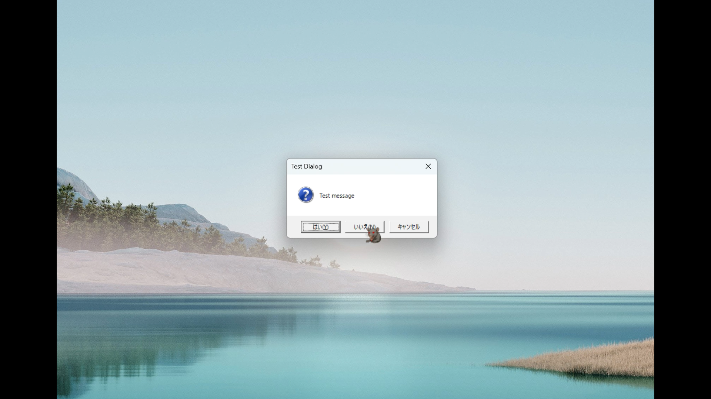
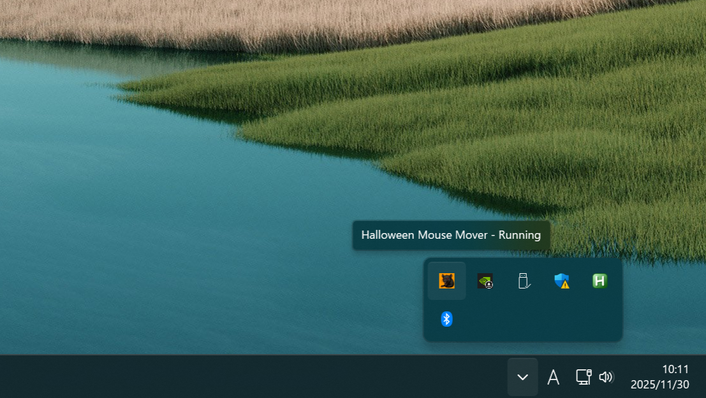
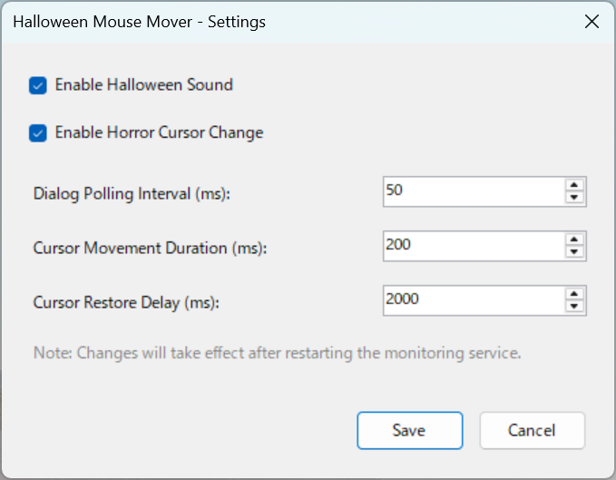

# 🎃 Halloween Mouse Mover

[](https://opensource.org/licenses/MIT)
[](https://dotnet.microsoft.com/)
[](https://www.microsoft.com/windows)

A Windows desktop application that automatically moves the mouse cursor to negative buttons (No, Cancel, Close) when dialog boxes appear, with Halloween-themed sound effects and cursor changes. Inspired by the classic Japanese "Chu-Chu Mouse" application.

## ✨ Features

- 🎯 **Automatic Dialog Detection** - Monitors for new dialog windows in real-time
- 🔍 **Smart Negative Button Identification** - Intelligently identifies "No", "Cancel", "Close" and similar buttons
- 🌊 **Smooth Cursor Movement Animation** - Natural curved trajectory with easing for realistic movement
- 🎵 **Halloween Sound Effects** - Plays spooky sounds when moving the cursor
- 👻 **Horror Mouse Cursor Transformation** - Changes cursor to Halloween-themed design
- 🔔 **System Tray Integration** - Runs quietly in the background with tray icon
- ⚡ **Lightweight Background Operation** - Minimal resource usage while monitoring
- ⚙️ **Configurable Settings** - Customize behavior through settings dialog

## 🎃 Demo




## 🚀 Getting Started

### Prerequisites

- **Windows 10 or later**
- **.NET 6 Runtime** - [Download here](https://dotnet.microsoft.com/download/dotnet/6.0)

### Installation

1. Download the latest release from the [Releases](../../releases) page
2. Extract the ZIP file to any directory on your computer
3. Run `HalloweenMouseMover.exe`

### Usage

- The application will start and appear as an icon in your system tray
- It automatically detects dialog boxes and moves the cursor to negative buttons
- **Right-click** the tray icon to access:
  - ⚙️ Settings - Configure application behavior
  - ❌ Exit - Close the application
- The cursor will transform into a Halloween theme and play spooky sounds when activated

## 🛠️ Building from Source

### Requirements

- **Visual Studio 2022** or later (Community Edition works fine)
- **.NET 6 SDK** - [Download here](https://dotnet.microsoft.com/download/dotnet/6.0)
- **Windows 10 or later**

### Build Steps

```bash
# Clone the repository
git clone https://github.com/[your-username]/halloween-mouse-mover.git
cd halloween-mouse-mover

# Restore dependencies
dotnet restore

# Build the project
dotnet build

# Run the application
dotnet run --project HalloweenMouseMover
```

Alternatively, open `HalloweenMouseMover.sln` in Visual Studio and press F5 to build and run.

### Audio Files Note

⚠️ **Important**: The Halloween sound effect file (`Scream03.mp3`) is not included in this repository due to copyright considerations. To enable sound effects:

1. Prepare your own Halloween sound effect in MP3 format
2. Name it `Scream03.mp3`
3. Place it in the `HalloweenMouseMover/Resources/` directory
4. Rebuild the project

The application will work without the audio file, but sound effects will be disabled.

## 🔧 Technology Stack

- **.NET 6** - Modern cross-platform framework (Windows-specific features used)
- **Windows Forms** - UI framework for system tray integration
- **FlaUI** - UI Automation library for dialog detection
- **NAudio** - Audio playback library for sound effects
- **Win32 API** - Low-level cursor manipulation via P/Invoke

## 🔒 Security & Permissions

### Required System Permissions

This application requires the following system-level permissions to function:

- **UI Automation Access** - Required to detect dialog windows and identify buttons using FlaUI
- **Cursor Manipulation** - Required to move the system cursor and change cursor appearance via Win32 API
- **Audio Playback** - Required to play Halloween sound effects through system audio

### Limitations

- The application may not work with **UAC-elevated windows** (Administrator dialogs) due to Windows security restrictions
- The application cannot interact with the **secure desktop** (e.g., Windows login screen, UAC prompts)
- Some applications with elevated privileges may block cursor automation

### Privacy & Data Collection

- **No data collection** - This application does not collect, store, or transmit any user data
- **No network access** - The application operates entirely offline with no internet connectivity
- **No telemetry** - No usage statistics or analytics are gathered
- All operations are performed locally on your machine

## 🤖 Development with Kiro

This project was developed using [Kiro](https://kiro.ai), an AI-powered IDE that enhances development workflow through intelligent assistance and structured methodologies.

### Spec-Driven Development

The entire project was built using Kiro's spec-driven development methodology, which transforms ideas into working software through three structured phases:

1. **Requirements Phase** - Defined user stories and acceptance criteria using EARS (Easy Approach to Requirements Syntax) patterns and INCOSE quality rules
2. **Design Phase** - Created comprehensive architecture and component designs with detailed technical specifications
3. **Implementation Phase** - Executed tasks incrementally based on the spec, with each task building on previous work

All specification documents are available in the `.kiro/specs/` directory, providing full transparency into the development process.

### Vibe Coding

Kiro's Vibe coding feature was used throughout development to accelerate implementation:

- Natural language descriptions were converted into working C# code
- Architectural patterns and best practices were suggested and implemented
- Code refactoring and optimization were performed interactively
- Complex integrations (FlaUI, NAudio, Win32 API) were implemented with AI assistance

### Kiro Features Utilized

- **Specs** - Structured feature development with requirements, design documents, and task tracking
- **Steering** - Project-specific guidelines ensuring consistent code style, architecture patterns, and naming conventions
- **Context-Aware Assistance** - Kiro maintained awareness of the entire codebase for coherent implementations across multiple files

### Transparency and Review

The `.kiro` directory is intentionally included in this repository to demonstrate how AI-assisted development was used. Reviewers can examine:

- **`.kiro/specs/`** - Complete specification documents showing requirements, design decisions, and implementation plans
- **`.kiro/steering/`** - Development guidelines and project-specific rules used throughout the project
- **`.kiro/hooks/`** - Automated workflows and agent hooks (if any)

This transparency allows others to understand not just the final code, but the entire development process and decision-making journey.

## 📜 License

This project is licensed under the MIT License - see the [LICENSE](LICENSE) file for details.

## 🙏 Acknowledgments

- Inspired by the classic Japanese "Chu-Chu Mouse" application
- Halloween sound effects and cursor design for spooky atmosphere
- Built with modern .NET technologies for reliability and performance

---

**Note**: This application is intended for entertainment purposes. Use responsibly and be aware that it will interfere with dialog interactions on your system while running.
